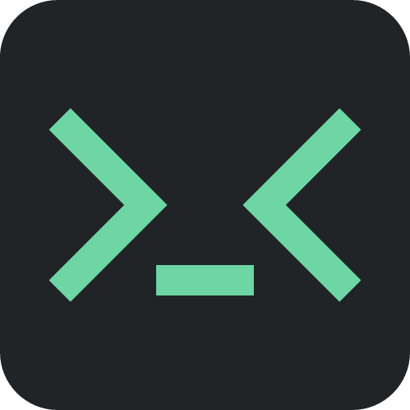
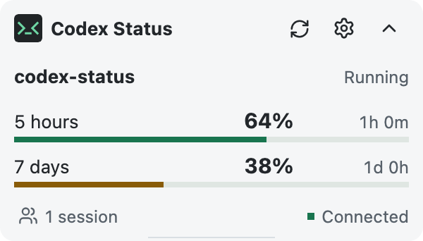
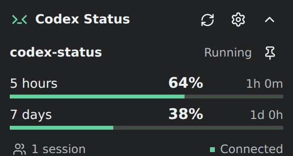

<p align="center">
  
</p>

<h1 align="center">Codex Status</h1>

<p align="center">A compact, cross-platform status window for Codex CLI</p>

<p align="center">
  <a href="README.zh-CN.md">简体中文</a>
</p>

<p align="center">
  
  
</p>

## Overview

Codex Status displays local sessions, context usage, account quotas, and status notifications. It watches session data without modifying it and queries the configured `codex app-server` process for live account data.

Command approval requests and newly completed tasks play their bundled bell sounds by default, while low-quota warnings use the bundled battery sound. Completion and low-quota alerts offer alternate sounds. Every sound can be selected, previewed, or disabled under Notifications in Settings.

The app stays in the system tray on Windows and Linux and in the menu bar on macOS, without adding a taskbar or Dock entry. The tray's **Show / Hide** option can hide the card without stopping background monitoring or sounds. Turn off Status notifications while leaving Task completion sound set to a tone for sound-only alerts.

By default, it resolves `codex` from `PATH` and reads `CODEX_HOME`, falling back to `~/.codex`. The executable and data roots are configurable in the app.

## Install

Download the release artifact and matching `.sha256` file from GitHub Releases:

| Platform       | Artifact                                    |
| -------------- | ------------------------------------------- |
| Windows 11 x64 | `codex-status-vX.Y.Z-windows-x64.exe`       |
| macOS 14+      | `codex-status-vX.Y.Z-macos-{x64,arm64}.dmg` |
| Ubuntu x64     | `codex-status-vX.Y.Z-linux-x64.deb`         |

Verify the checksum before use. Run the Windows `.exe` directly, open the macOS `.dmg` and move Codex Status to Applications, or install the Ubuntu package:

```sh
sudo apt install ./codex-status-vX.Y.Z-linux-x64.deb
```

Automatic macOS releases are currently unsigned. After verifying the checksum and moving the app to Applications, if macOS blocks it, remove the quarantine attribute:

```sh
xattr -dr com.apple.quarantine "/Applications/Codex Status.app"
```

## Develop

Requirements: Node.js 24 (`>=24.19 <25`), pnpm 11.25, Rust 1.98, and the [Tauri 2 platform prerequisites](https://v2.tauri.app/start/prerequisites/).

```sh
pnpm install --frozen-lockfile
pnpm verify
pnpm dev
pnpm build
```

`pnpm verify` runs formatting, type, lint, unit, integration, and browser checks. All generated files stay under `build`: release packages and checksums go to `build/artifacts`, reusable Cargo and Vite data to `build/cache`, frontend assembly files to `build/staging`, and test output to `build/test`. Each `pnpm build` replaces previous release output. Use `pnpm clean` to remove outputs while keeping reusable caches, or `pnpm clean:cache` to remove the caches.

On Windows, use `./scripts/build/windows.ps1 verify|build|dev` to initialize the MSVC environment and run the selected task.

## Documentation

- [Release runbook](docs/RELEASE.md)
- [MIT License](LICENSE)
