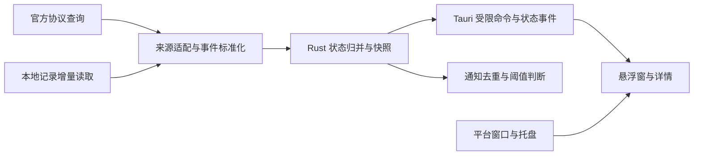

# Codex Status 规划

日期：2026-09-05。阶段：规划完成，尚未开始实现。

## 1. 产品定位

一个常驻桌面的 Codex 状态悬浮窗，让用户在编辑器、终端和其他窗口之间工作时，随时看见额度、当前任务和需要处理的状态。

“小巧”同时指窗口面积、安装体积、运行开销和操作成本。“信息完善”通过常驻摘要与按需展开实现，不把所有信息挤在一个小窗里。

首版按以下使用场景设计：

- 用户主要在本机使用 Codex CLI，悬浮窗可以独立启动，不要求从悬浮窗发起任务。
- 支持一个账户、多个本地会话；Windows 下使用 WSL 的用户也需要明确的接入路径。
- 优先兼容 CLI，IDE 扩展及桌面应用的可观测能力分别验证，不承诺它们共享同一个状态服务。
- 产品只观察状态，不发送提示词、不批准操作、不修改会话，也不代替 Codex 的工作界面。

当前目录只有规则文件、空任务模板和空忽略文件，没有应用代码、构建脚本或可复用实现；当前目录也尚未初始化 Git。本文给出后续实现方案，不表示这些能力已经可用。

## 2. 技术选型

### 2.1 推荐方案

采用 **Rust + Tauri 2 + TypeScript + Svelte 5**。

| 层次 | 选择 | 用途与理由 |
| --- | --- | --- |
| 状态与数据处理 | Rust、Cargo、Tokio、Serde | 处理进程、结构化协议、事件归并和本地记录；靠近 Codex 公开的 Rust 核心实现方向 |
| 桌面容器 | Tauri 2 | 提供窗口、托盘、通知和平台能力，使用系统 WebView，适合小型常驻工具 |
| 界面 | Svelte 5、TypeScript、Vite | 编译型界面，组件数量少；TypeScript 与官方 SDK 及协议类型生成工具相近 |
| 样式与图标 | 普通 CSS、Lucide | 自定义少量设计变量，避免引入大型组件库；图标保持一致 |
| 包管理 | pnpm、Cargo | 锁定依赖，Node.js 仅用于开发与构建 |
| 验证 | Rust 单元测试、Vitest、Playwright、平台实测 | 分别覆盖状态逻辑、界面行为、布局和桌面能力 |
| 交付 | 各平台单文件可执行程序、GitHub Actions | Windows、macOS、Linux 分开构建和验证 |

Rust 方向以官方公开的 `codex-rs/app-server` 组件为依据，TypeScript 依据官方 SDK 文档。[S1][S2][S3] 本方案选择 Tauri 和 Svelte 是本项目的工程判断；已查阅的官方资料没有确立 Codex 桌面应用的完整 UI 工具链，不声称与其完全相同。

首版通过进程协议集成用户已安装的 Codex，不直接依赖其内部 Rust crate，也不把整个 Codex 源码引入本仓库。这样可以独立发布，并隔离上游内部 API 变动。正式实现时固定工具链和依赖版本，不把浮动的 `latest` 作为可复现构建依据。

### 2.2 备选方案

| 方案 | 优势 | 取舍 |
| --- | --- | --- |
| Tauri + Svelte | Rust 后端与紧凑 UI 兼顾，文本布局和无障碍工具成熟 | 需要维护 Rust 与 TypeScript，系统 WebView 存在平台差异 |
| Rust + egui / iced | 业务与界面都使用 Rust，不依赖系统 WebView | 托盘、无障碍、文本呈现及平台窗口行为仍需单独验证 |
| Electron + TypeScript | 桌面生态成熟，渲染环境一致 | 额外携带浏览器运行时，与体积和常驻开销目标不够匹配 |

先用 Tauri 做最小原型并实测。只有在系统 WebView、内存或窗口能力无法满足目标时，才重新评估纯 Rust GUI，不同时维护两套界面。

## 3. 信息范围

### 3.1 常驻摘要

默认展开的紧凑窗约为 **300 × 128 逻辑像素**；允许按字体和屏幕工作区增长，不使用会裁切文字的绝对高度。另提供约 **240 × 40** 的单行折叠态。

| 信息 | 默认呈现 | 语义 |
| --- | --- | --- |
| 项目与会话状态 | 项目短名、状态图标和短词 | 运行中、等待批准、等待输入、已完成、失败等 |
| 额度 | 最相关的两个额度窗口、剩余百分比 | 根据服务返回的窗口长度生成标签，常见为 5 小时和 7 天，但不写死 |
| 重置时间 | 紧邻相应额度的简短倒计时 | 展开后同时提供本地绝对时间 |
| 多会话提示 | 会话数量和切换入口 | 切换当前关注会话，支持固定 |
| 数据异常 | 图标与“离线”“未登录”“已过期”等短词 | 不以 0% 代替未知值 |

折叠态只保留状态、项目短名和主要额度；额度缺失时显示不可用状态。点击展开不切换原工作应用；键盘交互时允许正常获取焦点。

### 3.2 展开详情

详情宽度默认 360 逻辑像素，高度不超过屏幕工作区的 70%，通过滚动展示。按行和细分隔线组织内容，不嵌套卡片。

| 分区 | 信息 | 缺失时的处理 |
| --- | --- | --- |
| 会话 | 项目、会话名、模型、推理强度、当前步骤、回合耗时、最近事件 | 显示可验证字段，缺失字段为“未知”或不呈现 |
| 额度 | 各额度桶、窗口长度、剩余比例、重置时间、服务返回的点数信息 | 区分未登录、不支持、暂不可用、已过期 |
| 用量 | 最近回合及会话累计 input / cached input / output / total token | 明确口径，累计快照不重复相加 |
| 上下文 | 已用量、上限、占用比例、压缩状态 | 仅在来源明确提供可比较字段时显示比例 |
| 会话列表 | 项目、状态、最近活动、固定标记 | 同名项目可查看完整路径，多数据根不会相互覆盖 |
| 连接 | 来源、版本、最近成功更新时间、简短错误和重试入口 | 完整诊断在单独视图查看，不挤占摘要窗 |

账户标识默认脱敏。多个额度桶按服务提供的标识维护；摘要优先显示当前模型对应的桶，无法确定映射时让用户选择，不猜测模型与额度关系。

API key 使用量不等于 ChatGPT 订阅额度。费用估算、账户余额、全账户历史消费不进入首版默认视图；将来增加时必须有相应数据和定价依据，且明确标记估算。[S2]

### 3.3 首版交互

- 拖动、折叠、展开、置顶开关、位置记忆、显示器变化后自动回到可见区域。
- 托盘菜单提供显示/隐藏、刷新、设置和退出；关闭悬浮窗默认隐藏，有明确的退出命令。
- 无托盘的平台保留普通窗口入口和退出能力，不能隐藏成无法找回的后台进程。
- 固定关注会话；未固定时可选自动关注最近活动会话，用户展开详情期间不自动切换。
- 状态通知覆盖等待处理、完成、失败、额度低；同一事件去重，可关闭、可静音。
- 跟随系统的浅色/深色主题；开机启动和全局快捷键默认关闭，由设置启用。
- 手动刷新进行去重和节流；按钮刷新期间保持尺寸稳定。

首版不包含聊天输入、批准按钮、任务控制、多账户切换、云端同步、复杂统计图表或自动更新。以后增加操作能力时单独评审权限与交互。

## 4. 视觉与窗口规则

整体采用平面化的中性灰底色、清晰文字、细分隔线和少量语义色。绿色表示健康或完成，琥珀色表示需关注，红色表示错误；所有颜色都有文字或图标对应，不依赖颜色单独传达信息。

- 圆角不超过 6px，不使用渐变、毛玻璃、大阴影、装饰插画或大标题。
- 正文字号默认 13px，关键数字 15px，说明标签不小于 12px；设置页可以放大字体，字间距为 0。
- 标题、数值、图标使用稳定的布局列；数字等宽，加载和状态更新不引起窗口跳动。
- 工具命令优先使用图标按钮和短 tooltip；数值用输入或步进控件，二元选项用开关。
- 长路径和长会话名在摘要中省略，在详情中换行或提供查看完整值的入口，不依赖缩小字体。
- 信息提示限于具体状态和必要的错误处理，不在界面放功能介绍、操作教程或冗长小字。
- 支持键盘焦点、可访问名称、屏幕阅读器和减少动效设置；拖动区与可点击控件明确分开。
- 常规文本对比度至少 4.5:1，图标目标区域至少 28 × 28 逻辑像素。

需覆盖浅色/深色、100%/150%/200% 缩放、中文/英文长文本、双显示器和小工作区。桌面工具不承诺移动端运行；开发预览仍应在窄视口内无横向溢出。

## 5. 数据来源与可信边界

### 5.1 已有官方依据

查阅日期：2026-09-05。以下是文档事实，不等于用户安装的任意版本均提供这些能力。[S2]

| 需求 | 已公开能力 | 集成约束 |
| --- | --- | --- |
| 账户与额度 | `account/read`、`account/rateLimits/read`、`account/rateLimits/updated` | 额度接口面向 ChatGPT；认证模式和版本差异需要识别 |
| 会话发现 | `thread/list`、`thread/read` | 可以读取历史；`thread/read` 不会订阅事件，也不恢复会话 |
| 运行状态 | `thread/status/changed`、`turn/started`、`turn/completed` | 取决于所连接进程和会话订阅，不是系统范围的广播 |
| token 用量 | `thread/tokenUsage/updated` | 事件归属当前可观测会话，不可当成全账户用量 |
| 接口契约 | `generate-ts`、`generate-json-schema` | 生成结果绑定执行命令的 Codex 版本 |
| 传输 | 默认 stdio 上的逐行 JSON；另有 WebSocket 等方式 | 线上的 JSON-RPC 消息省略 `jsonrpc` 字段；文档将 WebSocket 标为实验性且不支持生产使用 |

官方还公开了账户用量摘要等接口，但这不是首版运行所必需的能力，兼容版本确定前不把它加入硬依赖。

### 5.2 接入策略

采用“官方只读查询优先，本地记录按版本兼容”的双来源方案，按字段选择有效证据。

1. 发现用户指定或系统路径内的 Codex 可执行文件，读取版本；数据目录支持显式配置，并识别所选运行环境的 `CODEX_HOME`。
2. 需要账户查询时，按需启动一个由本应用管理的 `codex app-server` 子进程，通过 stdio 初始化连接。账户认证交给 Codex 自身处理。
3. 调用经过版本能力检查的账户、额度和会话只读方法。应用不自行解析、复制或保存认证凭据；底层 Codex 可能正常刷新其自有认证文件。
4. 对其他进程中已存在的会话，先验证可用的只读观察接口。独立启动的 app-server 所报告的 `notLoaded` 不能解释为其他客户端的会话已停止。
5. 正式接口无法观察时，在经过验证的版本范围内读取本地会话记录。解析结构化事件，使用文件监听和增量读取；不解析终端绘制文本。
6. 无可靠活动证据时显示“最近活动”或“未知”，不通过文件修改时间、进程存在或超时自行判定成功、失败、等待批准。

**关键验证门槛：**必须证明悬浮窗能观察至少一个独立启动的真实 CLI 会话，且不会改变该会话的运行、订阅或审批。不能通过隐式调用 `thread/resume`、`turn/start` 或回复批准请求来取得状态。验证失败时，P0 标为受阻，记录可行范围，不能把仅有额度的版本算作完整首版。

本地记录格式视为内部兼容接口，不假设路径、文件名或字段永远不变。格式识别基于结构和版本，兼容表记录支持范围；不按项目名、测试名、样例或具体会话写特判。未知字段可忽略，关键结构缺失须显式降级。

对 app-server 的生命周期只管理本应用启动的进程；退出时不终止用户的 CLI。已有端点接入属于后续增强，在权限和只读观察语义验证完成前不作为默认路径。

### 5.3 字段有效性

统一为每个状态字段保留 `value`、`source`、`observedAt` 和 `quality`。数据质量分为 `fresh`、`stale`、`unavailable`、`unsupported`；业务状态与连接状态分开维护。

- 数值缺失和真实的 0 分开；不支持的字段不会显示虚假进度条。
- 同字段优先采用适用且新鲜的权威来源；旧缓存不能盖过新的确定事件。
- 不同来源只有在会话身份和数值口径一致时才归并；用数据根标识和会话 ID 联合定位会话。
- 额度按服务返回的桶、窗口长度和重置时间解释，不把所有账户硬编码为固定窗口。
- 窗口重置时间到达时先刷新，刷新失败则标为过期，不直接把额度改成 100%。
- token 累计快照采用替换语义；只有明确的增量事件才累加。cached input 与 input 的包含关系按协议解释，避免重复计数。
- 上下文比例只使用同一口径的当前上下文和上限，会话累计 token 不能代替当前上下文。
- 断网保留最近成功值及更新时间；空闲无新事件并不必然代表断线，需结合来源健康状态判断。

### 5.4 更新策略

会话信息优先由事件或文件变化驱动。历史扫描建立索引后仅处理变化，不每秒重读整个目录；历史页按需加载。

账户额度初始按 60 秒刷新，隐藏或空闲时放宽至 180 秒；可按版本和实测限流调整。会话事件与额度请求分开，不因 token 流触发大量网络查询。显式刷新合并重复请求；错误指数退避并加抖动，认证失败暂停查询直至账户状态变化。

文件读取须处理未完整写入的最后一行、截断、替换、轮转、删除及监听丢失；以定期低频核对弥补监听遗漏。超大或损坏记录有资源上限，错误只影响对应来源。通知和界面更新可以合并频率，但不能丢弃状态归并所需的关键事件。

## 6. 架构



### 6.1 模块边界

| 模块 | 职责 | 不承担的职责 |
| --- | --- | --- |
| `sources` | 版本探测、协议解析、读取游标、来源健康 | 界面排版、最终业务状态 |
| `status` | 标准事件、状态机、字段质量、会话聚合 | 文件监听、网络访问、窗口调用 |
| `platform` | 窗口、托盘、快捷键、通知、WSL 接入 | token 与额度业务计算 |
| `settings` | 用户偏好、原子写入、配置迁移 | 保存认证密钥或完整对话 |
| `commands` | 暴露受限操作和快照，校验参数 | 向前端开放通用 shell 或任意文件访问 |
| 前端 | 渲染、展开状态、筛选、交互 | 自行扫描目录、直接连接 Codex、重复计算业务状态 |

状态逻辑采用可注入时钟的纯函数归并器，适配器输出标准事件。内部类型与上游协议类型分开，避免接口变化扩散到界面。前端启动先取快照，再处理带递增修订号的更新；重连或漏序时重新取快照。

初期不增加插件系统、数据库或额外服务进程。只缓存必要索引和脱敏状态，设置采用版本化 JSON；数据量实测需要时再考虑 SQLite。

### 6.2 业务状态

会话状态至少包含 `unknown`、`idle`、`running`、`waitingApproval`、`waitingInput`、`completed`、`failed`、`interrupted`。显示优先级为需要用户处理、失败、运行中、其他状态，数据陈旧程度另外显示。

完成和失败由明确事件决定；等待状态由对应请求或可靠状态标志进入，由解决事件或新回合更新退出。没有会话时显示“无会话”，不是“离线”。一台机器可以同时有多个不同状态的会话。

### 6.3 建议目录

```text
codex-status/
  docs/
    PLAN.md
  src/
    ui/
    state/
    types/
  src-tauri/
    src/
      sources/
      status/
      platform/
      settings/
      commands/
    capabilities/
  tests/
    fixtures/
    e2e/
  scripts/
  build/
  AGENTS.md
  TODO.md
```

该目录是实施建议，当前只创建规划文件。相同类别的模块集中管理；新增抽象必须消除实际重复，不预先拆出大量 crate。

## 7. 跨平台与资源预算

### 7.1 平台范围

| 平台 | 首版目标 | 验证重点 |
| --- | --- | --- |
| Windows 11 x64 | 原生窗口、托盘、置顶、单文件可执行程序 | WebView2、多 DPI、任务栏、睡眠恢复 |
| Windows + WSL2 | Windows 原生悬浮窗观察选定发行版的 CLI | 在发行版内定位数据根；通过 `wsl.exe` 参数数组连接，不依赖高频扫描网络路径 |
| macOS 14+ arm64 / x64 | 原生窗口、菜单栏入口、签名单文件可执行程序 | 多桌面、全屏窗口、权限和焦点行为 |
| Ubuntu 22.04 / 24.04 x64，X11 | 原生窗口、可用环境中的托盘与置顶 | WebKitGTK、桌面依赖、字体、单文件可执行程序 |
| Linux Wayland | 普通窗口可用，窗口增强功能按能力降级 | 合成器可能限制全局定位、置顶、托盘、快捷键和穿透 |

跨平台不代表窗口管理能力完全一致。设置仅提供当前可用能力；Wayland 无法保证的能力在兼容文档中说明，正式发布支持表记录测试过的桌面环境。鼠标穿透延后，避免导致无法操作或失去恢复入口。

WSL 接入使用明确选择的发行版和用户环境，以 stdin/stdout 传输结构化状态。若官方只读接口不足，再实现共用 `sources` 逻辑的最小 Rust 采集辅助程序；它负责在发行版内监听，不携带模型运行时。该路径必须计入性能与生命周期测试。

### 7.2 初始性能目标

以下是待实测的设计预算，不是已达到的性能承诺。基线为发行构建、一个数据源、10 个可见会话、1 万个历史会话索引，空闲采样 10 分钟；记录硬件、系统、Codex 和 WebView 版本。

| 指标 | 初始目标 | 计量约定 |
| --- | --- | --- |
| 应用可执行文件 | 不超过 20 MiB | 单架构文件；另列运行所需系统组件与已有 Codex 大小，不隐去额外下载 |
| 常驻内存 | 不超过 150 MiB | 统计本应用、WebView 和本应用新增的查询/采集子进程；按平台注明 RSS 或私有工作集口径 |
| 空闲 CPU | 单逻辑核平均不超过 0.5% | 包含新增子进程，不以整机多核平均稀释 |
| 首屏 | 冷启动后 1 秒内显示窗口与可用缓存 | 远端额度不阻塞首屏，首次同步时间单独统计 |
| 活动可见延迟 | 来源可观测事件产生后 P95 不超过 1 秒 | 额度按刷新周期单独考核；本地记录写盘延迟单列 |
| 稳定性 | 连续运行 8 小时无持续内存增长、无孤儿进程 | 覆盖休眠、唤醒、断网、来源退出与重连 |

超出预算时先排查全量扫描、重复子进程、无效轮询和高频渲染，再决定是否调整框架。预算如需修改，单独记录依据，不能通过排除实际驻留子进程来达到数字。

## 8. 验证与构建约定

架构先定义数据契约和不变量，再编写失败用例，再实现行为。每个迭代在 `TODO.md` 更新状态，并执行对应任务验收及原有完成标准。

### 8.1 必测场景

- 状态：并发会话、重复与乱序事件、断线后的旧事件、等待处理和解决、新回合覆盖旧回合、进程退出不伪报完成。
- 数值：0、缺失、超界、多个额度桶、不同窗口长度、时间跨日和时区变化、重置过期、累计 token 重复通知、上下文压缩。
- 解析：未知字段、不同支持版本、半行、损坏行、截断轮转、文件替换、监听丢失、超大记录和多数据根。
- 隐私：前端和日志没有 token、认证文件内容或默认完整对话；所有显示值按文本渲染；路径和进程参数不能形成 shell 注入。
- 界面：折叠与展开、长文本、大字体、深浅主题、空数据、错误、刷新中、窄工作区均无重叠和裁切。
- 桌面：托盘退出、无托盘回退、位置恢复、显示器拔插、DPI、焦点、通知去重、休眠恢复和 WSL 子进程退出。

协议契约使用脱敏记录和结构化 fixture，补充针对状态不变量的性质测试。fixture 应覆盖通用行为，不能为通过某个样例加入业务特判。临时诊断测试验证完删除，有长期价值的回归测试留在正式测试目录。

Playwright 负责浏览器可验证的界面与截图；它不能证明原生置顶、托盘、窗口焦点和 macOS 桌面行为。上述能力必须在实际目标平台验证，不能用网页预览代替。

### 8.2 构建规则

在工程初始化阶段提供统一任务入口，计划包含 `pnpm verify`、`pnpm build` 和开发命令；**这些命令目前尚不存在**。

- 每个独立构建任务开始前，完整清理仓库内的 `build` 目录，不复用之前留下的产物。
- 清理脚本只接受解析后的仓库 `build` 目录，拒绝指向仓库外的符号链接和宽泛删除目标。
- Cargo target、Vite 输出和单文件发行产物统一置于 `build` 下；依赖下载缓存可以复用，编译产物不跨平台复用。
- 一次完整构建流水线内先生成前端，再编译桌面端并输出一个平台可执行文件；不生成安装器或应用包。
- 开发监听在一个已清理的任务内增量工作，重新启动开发任务前清理。发行构建与验证不得借用正在运行的开发产物。
- 验证入口执行格式、类型、Rust lint、单元测试和界面测试；会触发编译的独立验证任务也遵守清理规则。
- 三个平台在各自系统构建与实测。签名证书和分发账号在发布阶段配置，没有签名或实机记录的产物不标记为正式发布完成。

不在本轮文档工作中安装工具链或执行应用构建。当前 `TODO.md` 的“完成标准”正文为空，保留原样；下节验收条件属于新增任务定义，不替换原有完成标准。

## 9. 实施顺序与验收

优先级从上到下执行，先验证数据可达性，再投入完整界面。工作量按一名熟悉 Rust 和前端的开发者估计，合计约 18 至 26 个工作日；不含等待签名材料、设备和上游修复的时间。

### P0.1 数据可行性验证，2 至 3 日

交付：能力探测原型、支持版本记录、脱敏事件样本、来源可见范围报告。

验收：

- 真实 ChatGPT 登录环境下读取额度及重置时间；API key、未登录和离线显示各自正确状态。
- 观察独立运行的真实 CLI 会话，核实运行、完成、失败、用量及等待状态各字段的来源；无法获得的字段有明确降级。
- 不恢复或改变原会话，不回复审批，不改写其记录；记录启动查询进程的认证刷新等正常副作用。
- 核实原生与 WSL 数据定位；分别记录 CLI、IDE、桌面应用的支持、受限或未验证结果。
- 锁定至少一个已实测 Codex 版本和生成协议契约；无法满足独立会话观察时暂停后续“完整首版”承诺。

### P0.2 工程与窗口原型，2 至 3 日

依赖：P0.1 确认可行。

交付：Rust/Tauri/Svelte 工程、统一任务入口、清理脚本、三平台最小窗口。

验收：

- 目标平台能够从已清理的构建目录启动原型，类型、格式和 lint 检查通过。
- 托盘显示/隐藏/退出、置顶、拖动与位置恢复通过实测；不支持能力有可操作的普通窗口回退。
- 初测含查询子进程的体积和资源开销，记录与预算差距；退出后无残留自有子进程。

### P0.3 状态核心与数据接入，4 至 5 日

依赖：P0.1 的协议与 P0.2 的工程。

交付：来源适配器、字段质量模型、状态归并器、刷新退避、配置与必要索引。

验收：

- 第 8.1 节的状态、数值和解析用例通过；重复事件不重复累计，旧数据不覆盖新状态。
- 支持多会话与多数据根，已支持来源使用增量读取；损坏记录不导致应用崩溃或无限重试。
- UI 不参与业务归并，配置写入可恢复；前端与诊断日志不包含认证凭据。

### P0.4 悬浮窗完整工作流，3 至 4 日

依赖：P0.3。

交付：摘要、折叠态、详情、会话切换、设置、状态通知。

验收：

- 第 3 节首版信息与交互完成；缺失、不支持、离线、过期都有明确且简短的呈现。
- 图标、文字、数值更新不引起布局跳动；各缩放和长文本测试无重叠、溢出、裁切。
- 固定会话和通知去重有效；键盘可操作，主题、位置和偏好重启后恢复。
- 完成可复核的深浅主题截图与交互测试，不用静态样图代替真实接入。

### P1.1 跨平台兼容与 WSL，3 至 5 日

依赖：P0.4。

交付：平台适配、WSL 接入、兼容矩阵和平台验证记录。

验收：

- 第 7.1 节每个首版目标完成实测；Windows + WSL2 独立 CLI 会话可用。
- 第 8.1 节桌面场景通过；Wayland 降级有记录，隐藏后始终有恢复入口。
- 无源环境或不兼容版本能正常启动应用并呈现连接状态，不反复拉起失败子进程。

### P1.2 性能与稳定性，2 至 3 日

依赖：P1.1。

交付：可复现的测量方法、性能报告和长期运行结果。

验收：

- 在第 7.2 节基线下测量并达到预算；未达到的指标必须列为未完成，不只报告主进程。
- 8 小时运行、休眠恢复和多次重连无持续资源增长，监听与查询不会重复注册。
- 额度请求、错误重试和文件核对遵循频率限制，大历史目录不引起周期性全量读取。

### P1.3 首版打包与发布准备，2 至 3 日

依赖：P1.2。

交付：各平台单文件可执行程序、运行说明、兼容说明、许可证清单、版本记录。

验收：

- 各平台执行清理后的完整验证与发行构建，记录 Codex 支持版本和实际运行依赖。
- Windows、macOS、Linux 单文件可执行程序在干净环境直接启动和退出通过；替换程序文件不覆盖 Codex 数据。
- 对应签名与公证流程完成，校验和与许可证齐全；所需证书或设备缺失时本项保持未完成。
- 明确区分应用自身数据和 Codex 数据，卸载不删除用户会话或凭据。

### P2 后续候选，不作为首版完成条件

按实际使用反馈选择：多账户与更多来源、额外 Linux 桌面环境、经验证的已有服务端点接入、历史趋势、可信费用估算、可恢复的鼠标穿透、自动更新。每项开始前单独补充需求和验收，不提前承诺日期。

## 10. 本轮规划交付检查

- 目标、首版范围、数据边界、技术取舍、UI、架构、平台差异、资源预算和任务验收均有明确章节。
- Codex 接口事实有已查阅的官方来源；尚未验证的运行时能力与性能目标明确标注。
- `TODO.md` 按依赖和重要性列出后续任务，仅规划任务标为完成；原有完成标准保留。
- 本地文档链接可解析，文档无无效占位；未增加应用代码、依赖或构建产物。

## 11. 参考资料

以下官方页面已在制定规划时读取。接口以实施时选定的 Codex 版本及其生成 schema 为准。

- [S1] [Open Source](https://learn.chatgpt.com/docs/open-source)：公开组件列表，以及 App Server 的 `codex-rs/app-server` 源码入口。
- [S2] [Codex App Server](https://learn.chatgpt.com/docs/app-server)：初始化、传输、线程读取与订阅边界、运行状态、额度和 token 接口。原地址 `https://developers.openai.com/codex/app-server/` 当前重定向至此文档站。
- [S3] [Codex SDK](https://learn.chatgpt.com/docs/codex-sdk)：TypeScript SDK 与自定义客户端的接入定位。
- [S4] [Codex CLI](https://learn.chatgpt.com/docs/codex/cli)：CLI 安装方式与本地使用流程。原地址 `https://developers.openai.com/codex/cli/` 当前重定向至此页面；实际安装依赖仍需在目标平台验证。
